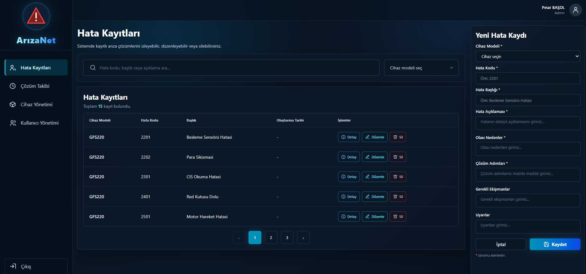
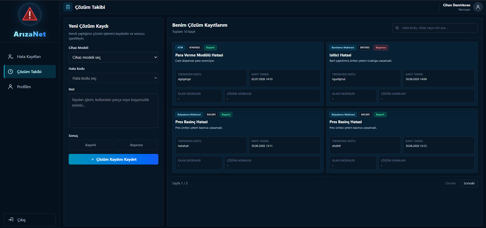

# 🚨 ArızaNet – Cihaz Arıza Çözüm Bilgi Sistemi

ArızaNet, cihazlarda oluşan hata kodlarının aranabildiği, hata detaylarının görüntülenebildiği ve çözüm süreçlerinin takip edilebildiği bir cihaz arıza çözüm bilgi sistemidir.

---

## 🚀 Proje Hakkında

ArızaNet, admin ve teknisyen kullanıcıları için farklı ekranlar sunan rol tabanlı bir web uygulamasıdır.

Admin kullanıcılar sistemdeki hata kayıtlarını, cihaz modellerini, kullanıcıları ve çözüm kayıtlarını yönetebilir. Teknisyen kullanıcılar ise hata kodlarını arayabilir, hata detaylarını inceleyebilir, çözüm kaydı oluşturabilir ve kendi çözüm geçmişini profil ekranından takip edebilir.

Proje geliştirilirken gerçek bir teknik servis sistemi mantığı temel alınmıştır. Bu nedenle hata kayıtları cihaz modelleriyle ilişkilendirilmiş, çözüm kayıtları teknisyenlere bağlanmış ve kullanıcı rolleri doğrultusunda ekran erişimleri sınırlandırılmıştır.

---

## ⚙️ Teknoloji Altyapısı


ArızaNet projesinde backend, frontend, veritabanı, güvenlik, mimari, konteynerleme, sürüm kontrolü, geliştirme ortamı ve API test araçları birlikte kullanılmıştır.

Backend tarafında Spring Boot tercih edilmiştir. Bu yapı sayesinde hata kayıtları, cihaz modelleri, kullanıcı yönetimi ve çözüm takip işlemleri REST API mantığıyla yönetilmiştir.

Frontend tarafında React kullanılmıştır. Admin ve teknisyen ekranlarının kullanıcı dostu, modern ve koyu temaya uygun şekilde hazırlanması React arayüzüyle sağlanmıştır.

Veritabanı tarafında Microsoft SQL Server kullanılmıştır. Kullanıcılar, cihaz modelleri, hata kayıtları ve çözüm takip kayıtları veritabanında saklanmaktadır.

Güvenlik tarafında Spring Security ve JWT yapısı kullanılmıştır. Böylece kullanıcı giriş işlemleri token tabanlı hale getirilmiş, admin ve teknisyen kullanıcıların erişebileceği ekranlar rol bazlı olarak ayrılmıştır.

Proje mikroservis mimarisine uygun şekilde geliştirilmiştir. Servislerin görevleri ayrılarak auth, user, fault, device, report ve solution tracking gibi bölümler daha düzenli yönetilmiştir.

Geliştirme sürecinde Docker, Git, GitHub, IntelliJ IDEA ve Swagger araçlarından yararlanılmıştır. Docker veritabanı ortamını çalıştırmak için, Git ve GitHub sürüm kontrolü için, IntelliJ IDEA geliştirme ortamı olarak, Swagger ise API testleri için kullanılmıştır.

---

## 🖥️ Uygulama Ekranları

### Admin Paneli



Admin panelinde hata kayıtları, çözüm kayıtları, cihaz modelleri ve kullanıcılar yönetilebilmektedir. Bu ekran üzerinden admin kullanıcı sistemdeki hata kayıtlarını listeleyebilir, arama ve cihaz modeli filtresiyle kayıtları daha kolay bulabilir.

Hata kayıt yönetimi ekranında admin yeni hata kaydı oluşturabilir, mevcut hata kayıtlarını düzenleyebilir ve silebilir. Yeni hata kaydı eklenirken cihaz modeli sistemde kayıtlı cihazlardan seçilir. Böylece oluşturulan hata kaydı ilgili cihazla doğru şekilde ilişkilendirilir.

Admin panelinde bulunan temel ekranlar:

- Hata Kayıtları
- Çözüm Takibi
- Cihaz Yönetimi
- Kullanıcı Yönetimi

Bu yapı sayesinde sistemdeki arıza kayıtları, cihaz bilgileri, çözüm süreçleri ve kullanıcı işlemleri tek panel üzerinden takip edilebilir.

---

### Teknisyen Paneli



Teknisyen paneli, normal kullanıcıların hata kayıtlarını görüntüleyebilmesi ve çözüm işlemlerini kaydedebilmesi için hazırlanmıştır.

Bu ekranda teknisyen önce cihaz modelini seçer, ardından seçilen cihaza ait hata kodunu seçerek yaptığı işlemle ilgili not girer. Sonuç alanında işlemin başarılı veya başarısız olduğunu işaretleyerek çözüm kaydını sisteme ekler.

Teknisyen tarafında bulunan temel ekranlar:

- Hata Kayıtları
- Çözüm Takibi
- Profilim

Teknisyen kullanıcı yalnızca kendi yetkisine uygun işlemleri yapabilir. Ekleme, düzenleme ve silme gibi admin işlemleri teknisyen ekranında yer almaz. Bu sayede sistemde rol bazlı erişim ayrımı korunmuş olur.

---

## 🚀 Kurulum ve Çalıştırma

Projeyi çalıştırmak için öncelikle veritabanı ortamının açık olması gerekir. Projede Microsoft SQL Server kullanılmıştır ve veritabanı Docker üzerinden çalıştırılabilir.

### Veritabanını Çalıştırma

```bash
docker-compose up -d
```

Veritabanı adı:

```text
ArizaNetDb
```

SQL Server portu:

```text
1433
```

### Backend Servislerini Çalıştırma

Backend servisleri Spring Boot ile geliştirilmiştir. Servisler IntelliJ IDEA üzerinden ayrı ayrı çalıştırılabilir.

Backend servisleri:

- api-gateway
- auth-service
- fault-service
- device-service
- user-service
- report-service
- solution-tracking-service

Her servis kendi klasörü içerisinden çalıştırılabilir.

```bash
mvn spring-boot:run
```

### Frontend’i Çalıştırma

Frontend klasörüne girilir:

```bash
cd frontend
```

Bağımlılıklar yüklenir:

```bash
npm install
```

Frontend başlatılır:

```bash
npm run dev
```

Uygulama varsayılan olarak şu adreste çalışır:

```text
http://localhost:5173
```

## 🔐 Kullanıcı Rolleri

Projede rol bazlı kullanıcı yapısı bulunmaktadır.

### Admin

Admin kullanıcı sistemdeki hata kayıtlarını, cihaz modellerini, kullanıcıları ve çözüm kayıtlarını yönetebilir. Admin panelinde ekleme, düzenleme, silme, arama, filtreleme ve detay görüntüleme işlemleri yapılabilir.

### Teknisyen

Teknisyen kullanıcı hata kayıtlarını görüntüleyebilir, hata kodu arayabilir, cihaz modeline göre filtreleme yapabilir ve kendi yaptığı çözüm işlemlerini sisteme çözüm kaydı olarak ekleyebilir.

---

## 👤 Örnek Kullanıcı Bilgileri

Projede admin ve teknisyen kullanıcı rolleri bulunmaktadır.

Admin kullanıcı sistemdeki hata kayıtlarını, cihaz modellerini, kullanıcıları ve çözüm kayıtlarını yönetebilir. Teknisyen kullanıcı ise hata kayıtlarını görüntüleyebilir ve çözüm kaydı oluşturabilir.

Örnek kullanıcı bilgileri proje tesliminde ayrıca paylaşılmıştır.

Kullanıcı rolleri:

- Admin
- Teknisyen

---

## 🔌 API Endpoint Listesi

Projede frontend ile backend arasındaki işlemler REST API endpointleri üzerinden yapılmaktadır.

### Auth

```http
POST /api/auth/login
```

Kullanıcı girişi yapmak için kullanılır. Başarılı giriş sonucunda JWT token bilgisi döner.

### Hata Kayıtları

```http
GET /api/fault-solutions
```

Sistemde kayıtlı tüm hata kayıtlarını listeler.

```http
GET /api/fault-solutions/{id}
```

Seçilen hata kaydının detayını getirir.

```http
GET /api/fault-solutions/search?query=2201
```

Hata kodu, cihaz modeli, hata başlığı veya açıklama alanına göre arama yapar.

```http
POST /api/fault-solutions
```

Admin kullanıcının yeni hata kaydı eklemesini sağlar.

```http
PUT /api/fault-solutions/{id}
```

Admin kullanıcının mevcut hata kaydını güncellemesini sağlar.

```http
DELETE /api/fault-solutions/{id}
```

Admin kullanıcının hata kaydını silmesini sağlar.

### Cihaz Modelleri

```http
GET /api/device-models
```

Sistemde kayıtlı cihaz modellerini listeler.

```http
GET /api/device-models/{id}
```

Seçilen cihaz modelinin detayını getirir.

### Kullanıcı Yönetimi

```http
GET /api/users
```

Sistemde kayıtlı kullanıcıları listeler.

```http
PUT /api/users/{id}
```

Kullanıcı bilgilerini güncellemek için kullanılır.

```http
PATCH /api/users/{id}/status
```

Kullanıcının aktif veya pasif durumunu değiştirmek için kullanılır.

### Çözüm Takibi

```http
GET /api/solution-tracking
```

Sistemde kayıtlı çözüm takip kayıtlarını listeler.

```http
POST /api/solution-tracking
```

Teknisyen kullanıcının yeni çözüm kaydı oluşturmasını sağlar.

---

## 🧪 Test ve Final Kontroller

Projenin final aşamasında admin ve teknisyen ekranları tek tek kontrol edilmiştir.

Kontrol edilen işlemler:

- Login işlemi
- Admin ve teknisyen rol ayrımı
- Hata kaydı listeleme
- Hata kodu arama
- Cihaz modeline göre filtreleme
- Hata detayı görüntüleme
- Admin hata kaydı ekleme
- Admin hata kaydı düzenleme
- Admin hata kaydı silme
- Cihazlara bağlı hata kayıtlarını görüntüleme
- Çözüm kaydı oluşturma
- Başarılı / başarısız çözüm sonucu işaretleme
- Kullanıcı listeleme
- Kullanıcı aktif / pasif durum yönetimi
- Profil ve çözüm geçmişi görüntüleme

Final kontroller sırasında test amaçlı oluşturulan cihaz, hata kaydı, çözüm kaydı ve kullanıcı verileri temizlenmiştir. Böylece proje sunum ve demo için daha düzenli hale getirilmiştir.

---

## 🔮 Eksik Kalan veya Geliştirilebilecek Yerler

Proje temel gereksinimleri karşılayacak şekilde tamamlanmıştır. Login, rol ayrımı, hata arama, hata detay görüntüleme, admin hata yönetimi, cihaz yönetimi, kullanıcı yönetimi ve çözüm takip işlemleri çalışır durumdadır.

İlerleyen süreçte projeye aşağıdaki özellikler eklenebilir:

- Hata kayıtlarına fotoğraf ekleme
- PDF olarak çıktı alma
- Excel import desteği
- Kullanıcı işlem logları
- Bildirim sistemi
- Cihaz bakım geçmişi takibi
- Daha gelişmiş raporlama ekranları
- Çözüm adımlarının daha interaktif gösterilmesi

---

## 👩‍💻 Geliştirici

Bu proje staj kapsamında geliştirilmiştir.

**Geliştirici:** Nisa Camcı  
**Proje:** ArızaNet – Cihaz Arıza Çözüm Bilgi Sistemi  
**Teknolojiler:** Java Spring Boot, React, SQL Server, Docker

