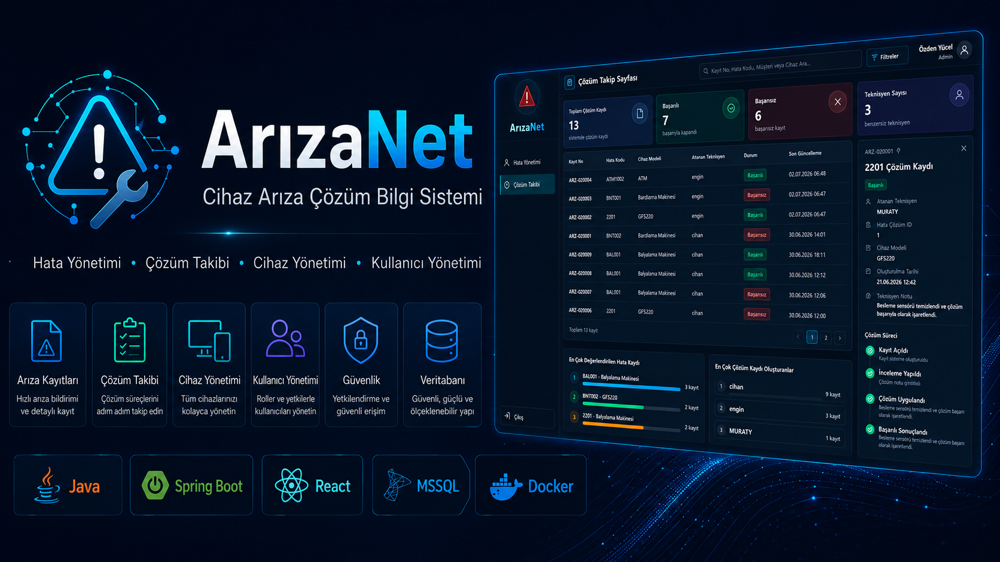
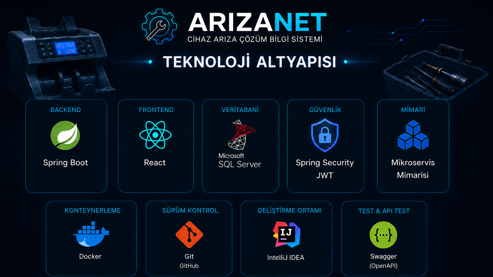

# 🚨 ArızaNet – Cihaz Arıza Çözüm Bilgi Sistemi

ArızaNet, cihazlarda oluşan hata kodlarının aranabildiği, hata detaylarının görüntülenebildiği ve çözüm süreçlerinin takip edilebildiği bir cihaz arıza çözüm bilgi sistemidir.

---

## 🚀 Proje Hakkında

ArızaNet, admin ve teknisyen kullanıcıları için farklı ekranlar sunan rol tabanlı bir web uygulamasıdır.

Admin kullanıcılar sistemdeki hata kayıtlarını, cihaz modellerini, kullanıcıları ve çözüm kayıtlarını yönetebilir. Teknisyen kullanıcılar ise hata kodlarını arayabilir, hata detaylarını inceleyebilir, çözüm kaydı oluşturabilir ve kendi çözüm geçmişini profil ekranından takip edebilir.

Proje geliştirilirken gerçek bir teknik servis sistemi mantığı temel alınmıştır. Bu nedenle hata kayıtları cihaz modelleriyle ilişkilendirilmiş, çözüm kayıtları teknisyenlere bağlanmış ve kullanıcı rolleri doğrultusunda ekran erişimleri sınırlandırılmıştır.

---

## ⚙️ Teknoloji Altyapısı

ArızaNet projesinde backend, frontend, veritabanı, güvenlik, mimari, konteynerleme, sürüm kontrolü, geliştirme ortamı ve API test araçları birlikte kullanılmıştır.

Backend tarafında Spring Boot tercih edilmiştir. Bu yapı sayesinde hata kayıtları, cihaz modelleri, kullanıcı yönetimi ve çözüm takip işlemleri REST API mantığıyla yönetilmiştir.

Frontend tarafında React kullanılmıştır. Admin ve teknisyen ekranlarının kullanıcı dostu, modern ve koyu temaya uygun şekilde hazırlanması React arayüzüyle sağlanmıştır.

Veritabanı tarafında Microsoft SQL Server kullanılmıştır. Kullanıcılar, cihaz modelleri, hata kayıtları ve çözüm takip kayıtları veritabanında saklanmaktadır.

Güvenlik tarafında Spring Security ve JWT yapısı kullanılmıştır. Böylece kullanıcı giriş işlemleri token tabanlı hale getirilmiş, admin ve teknisyen kullanıcıların erişebileceği ekranlar rol bazlı olarak ayrılmıştır.

Proje mikroservis mimarisine uygun şekilde geliştirilmiştir. Servislerin görevleri ayrılarak auth, user, fault, device, report ve solution tracking gibi bölümler daha düzenli yönetilmiştir.

Geliştirme sürecinde Docker, Git, GitHub, IntelliJ IDEA ve Swagger araçlarından yararlanılmıştır. Docker veritabanı ortamını çalıştırmak için, Git ve GitHub sürüm kontrolü için, IntelliJ IDEA geliştirme ortamı olarak, Swagger ise API testleri için kullanılmıştır.